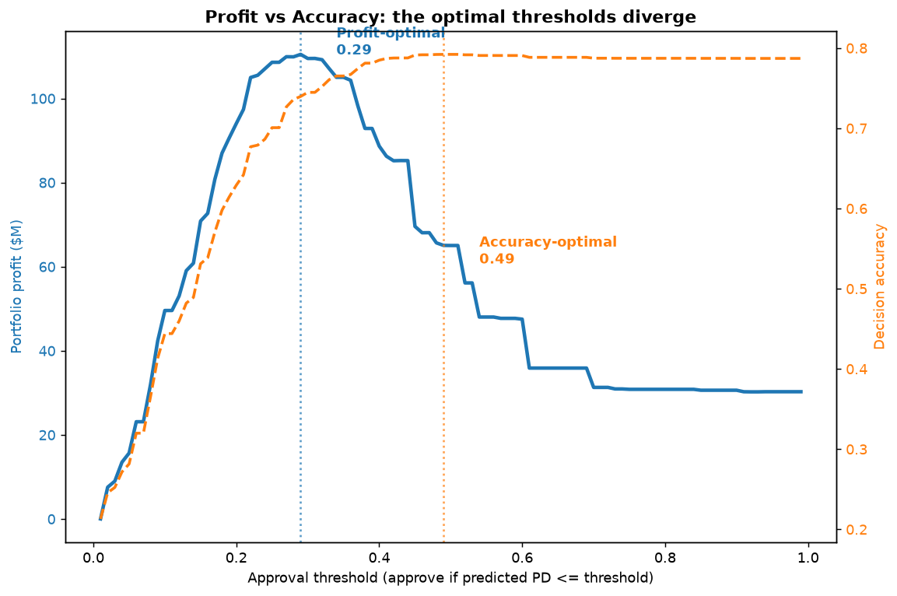
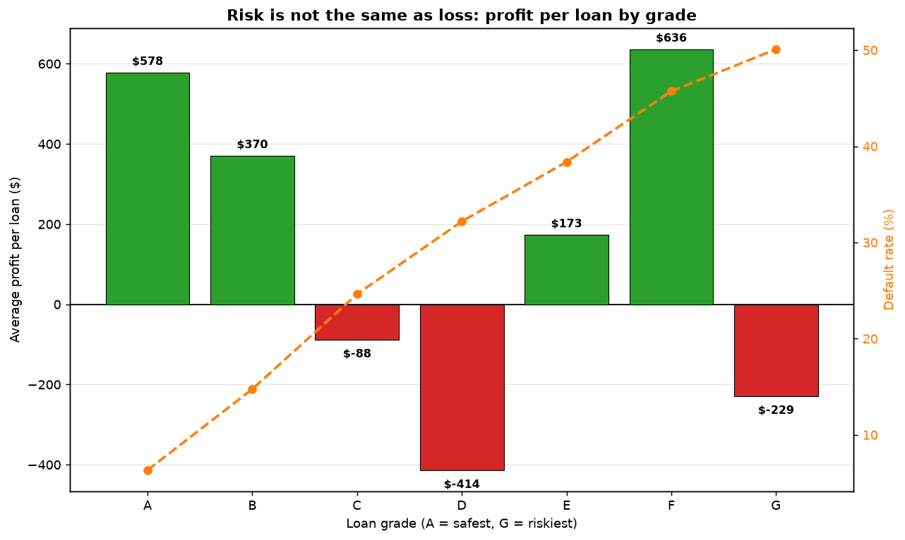
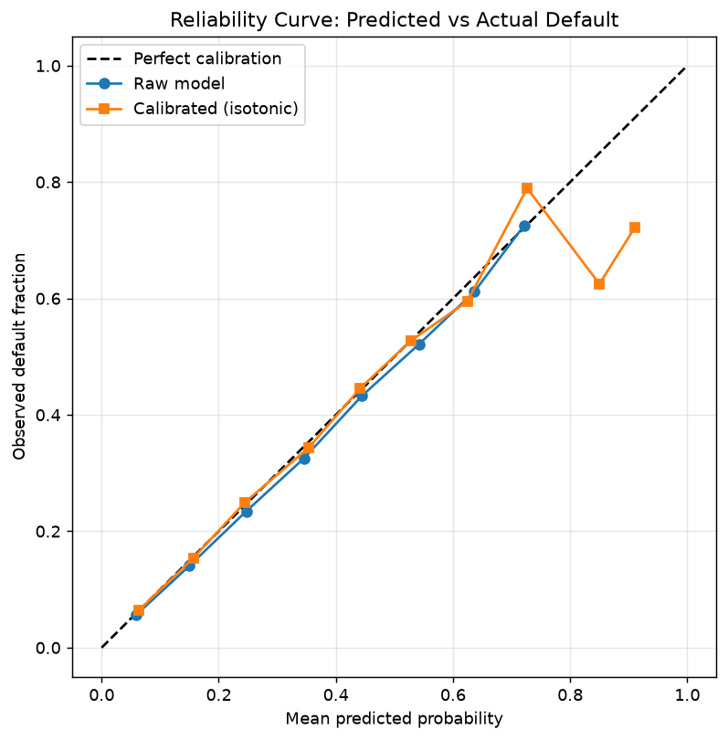

# Beyond the Score

### A profit-optimized credit decision engine

**Live decision tool:** [beyond-the-score-khaki.vercel.app](https://beyond-the-score-khaki.vercel.app)

Most credit models chase accuracy. A lender does not care about accuracy. It cares about money. This project builds a probability-of-default model on real LendingClub loans, then layers a dollar-denominated decision framework on top, and shows that the profit-maximizing approval policy is nowhere near the accuracy-maximizing one. The gap is worth tens of millions of dollars, and it is hiding in plain sight inside a dataset that thousands of tutorials have already used to predict default and stopped there.

The difference here is that prediction is treated as the easy part. The hard part, and the part a real risk team actually argues about, is what you do with the prediction once you have it.

---

## The headline finding

Measured on 225,639 out-of-time loans (issued 2017 to 2018, never seen during training):

- **The profit-optimal approval policy earns about $80M more than funding every applicant.** 95% confidence interval $73.6M to $86.8M, positive in 100% of 1,000 bootstrap resamples.
- **Accuracy says approve 96% of loans. Profit says approve 75%.** That 21-point gap in approval rate is the entire finding, restated as a policy a credit officer can act on.
- **One default erases the interest income from roughly 2.8 good loans.** A charged-off loan destroys principal while a good loan earns only the interest spread. An accuracy-tuned model is blind to that asymmetry, so it systematically over-approves into negative-expected-value loans.

### Profit and accuracy point in different directions

The blue profit curve peaks sharply at a 29% risk threshold, then falls off a cliff. The orange accuracy curve keeps climbing and plateaus around 49%. By the time you push the threshold out to where accuracy is maximized, profit has already collapsed from its $110M peak down to roughly $65M. Accuracy tells you that you are making great decisions at exactly the point where you are destroying the most money.

### Risk is not the same as loss

Default rate climbs smoothly from grade A to grade G. Profit does not.

| Grade | Default rate | Avg interest rate | Avg profit / loan |
|-------|-------------|-------------------|-------------------|
| A | 6.3% | 7.0% | +$578 |
| B | 14.7% | 10.6% | +$370 |
| C | 24.6% | 14.3% | **-$88** |
| D | 32.2% | 19.0% | **-$414** |
| E | 38.4% | 24.8% | +$173 |
| F | 45.7% | 29.7% | **+$636** |
| G | 50.1% | 30.9% | -$229 |

Grade F defaults nearly half the time yet earns more per loan than pristine grade A, because the 30% interest rate over-compensates for the risk. Meanwhile grades C and D look respectable and quietly lose money: the rate they carry does not cover the defaults they produce. The takeaway is risk-based pricing, not risk avoidance. A lender that simply avoids the scary grades leaves the most profitable loans on the table and keeps funding the muddy middle that bleeds.

The model is not crudely accepting or rejecting whole grades. It funds the good loans *within* each grade, going deep on A through C and cherry-picking only the best slivers of the high-risk grades. At the profit-optimal threshold it funds 100% of grade A, 76% of grade C, and only 3% of grade F.

---

## Try it: be the lender

The [live app](https://beyond-the-score-khaki.vercel.app) turns the finding into something you operate rather than read. You set the approval policy with a slider and watch three things move in real time: the portfolio profit, the approval rate, and how deep the model funds into each loan grade. The accuracy-optimal and profit-optimal policies are marked on the slider so you can drag between them and feel the money change. It is built as a static Next.js app with every result precomputed, so it responds instantly.

---

## Why you can trust the numbers

Six methodology choices anchor this project. Each one is something a credit risk analyst would probe in an interview, and each one is the difference between a portfolio piece that survives questioning and one that does not.

**1. Leakage discipline.** The raw LendingClub file is full of post-origination fields (total payments, recoveries, hardship plans, settlement records) that secretly encode the outcome. A loan only has a settlement record because it went bad. Most public notebooks accidentally include these and report a suspiciously high AUC. This project uses only the features available at the moment of the lending decision and documents every excluded column. The whole exercise is built on the premise that you only have what you know before you lend.

**2. Calibrated probabilities.** The profit math multiplies predicted default probability by real dollar amounts, so the probability has to be trustworthy, not just well-ordered. The model is calibrated with isotonic regression, and mean predicted default probability lands within 0.05 points of the actual rate.

The reliability curve hugs the diagonal across the populated probability range. The noise in the high-risk tail reflects thin sample sizes there, not miscalibration, almost no loan is predicted at an 85% default probability, so those bins are sparse.

**3. Out-of-time validation.** No random train/test split. The model trains on 2007 to 2016 vintages and is tested on 2017 to 2018 loans, mirroring real deployment where you lend to future borrowers you have not seen. Out-of-time AUC is 0.7268. The default rate drifted up from 19.7% in the training era to 21.3% in the test era, and the model held its discrimination through that drift. Vintage drift is the thing risk teams lose sleep over, and almost no portfolio project tests for it.

**4. Economic backtest.** The profit-optimal policy is applied to the held-out future vintages and compared, in dollars, against what LendingClub actually earned on those same loans. Policy versus reality, on loans the model never trained on.

**5. Bootstrap confidence.** The headline dollar figure is reported as a range, not a point estimate. One thousand resamples of the test portfolio put the lift between $73.6M and $86.8M, and the policy beat the naive baseline in every single resample.

**6. Reject inference (the honest limitation).** This is the most important caveat, and naming it is the senior move. The data contains only loans that were **approved**. We never observe what the rejected applicants would have done, so the model is trained on a censored sample. The true default rate across all applicants is almost certainly higher than what appears here, because the riskiest applicants were filtered out before the data was ever recorded. Every finding in this project is therefore **conditional on the already-approved population**. A production underwriting system would need reject-inference techniques or a champion/challenger holdout to address this properly. The honest framing is that this models how to allocate capital better among loans a platform already chose to fund, not how to underwrite the open applicant pool from scratch.

---

## How it was built

**Phase 1, data and leakage discipline.** Clean the 2.26M-row accepted-loans file down to 1.35M loans with a known final outcome (fully paid, charged off, or default). Map the target, build the decision-time feature set, document the exclusions. Base default rate: 19.96%.

**Phase 2, calibrated PD model.** Train a LightGBM probability-of-default model on the early vintages, then calibrate. Report AUC as table stakes and the reliability curve as the real evidence.

**Phase 3, the profit layer.** Define per-loan economics from the real amortization schedule (interest income computed from the actual installment stream, not a naive principal-times-rate shortcut, which would overstate profit and corrupt the finding). Sweep the approval threshold, locate the divergence, and break profit down by grade to surface the non-monotonic segment story.

**Phase 4, out-of-time economic backtest with confidence.** Apply the policy to the future vintages and bootstrap the dollar result.

**Phase 5, the live decision tool.** A Next.js app that makes the whole thing interactive.

---

## Stack

Python, pandas, scikit-learn, and LightGBM for the analysis pipeline. Next.js 14 and TypeScript for the live tool, deployed on Vercel. The app is fully static: all findings are precomputed into JSON, so the interface responds instantly with no backend.

## Data

LendingClub accepted-loans data, 2007 to 2018, publicly available on Kaggle. The raw dataset is not redistributed in this repository. Only aggregate findings (the threshold sweep and per-grade summaries) are committed, which is what the app reads.

## Repository layout

- `src/` the analysis pipeline: data cleaning, model training, calibration, the profit layer, the bootstrap, and the export scripts
- `web/` the Next.js decision-tool app
- `reliability_curve.png`, `profit_curve.png`, `segment_profit.png` the three figures

## Reproducing

1. Download the LendingClub accepted-loans file from Kaggle and place it in `data/`.
2. Run the scripts in `src/` in order: build the model table, train, calibrate, run the profit layer, bootstrap, then export.
3. `cd web && npm install && npm run dev` to run the app locally.

---

## Contact

**Sivakumar Reddy Yenna** Recent MS in Management Information Systems, Northern Illinois University

This project sits in the **Fintech / Credit Risk Analytics** lane. Open to **Business Analyst, BI Analyst, RevOps Analyst, and Healthcare / Operations Analyst** roles in the **Chicago metro area or anywhere in the US**.

- **Email:** reddysivakumar1361@gmail.com
- **LinkedIn:** [linkedin.com/in/sivakumar-reddy-yenna](https://www.linkedin.com/in/sivakumar-reddy-yenna)
- **Other projects:** [Logistics Analytics Dashboard](https://github.com/sivakumar-reddy/logistics-analytics) · [RevOps Customer Segmentation](https://github.com/sivakumar-reddy/revops-customer-segmentation) · [ed-twin: Emergency Department Digital Twin](https://github.com/sivakumar-reddy/ed-twin)
