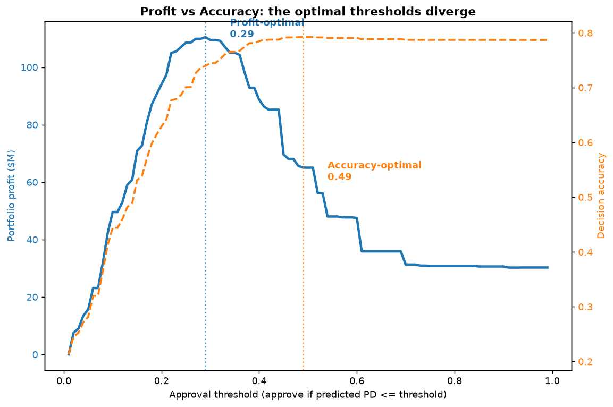
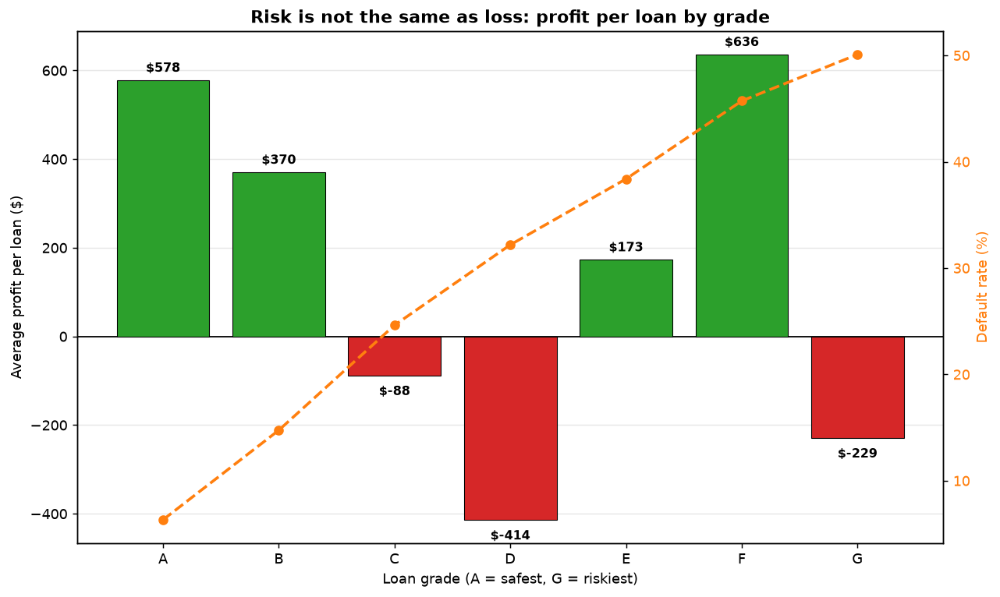
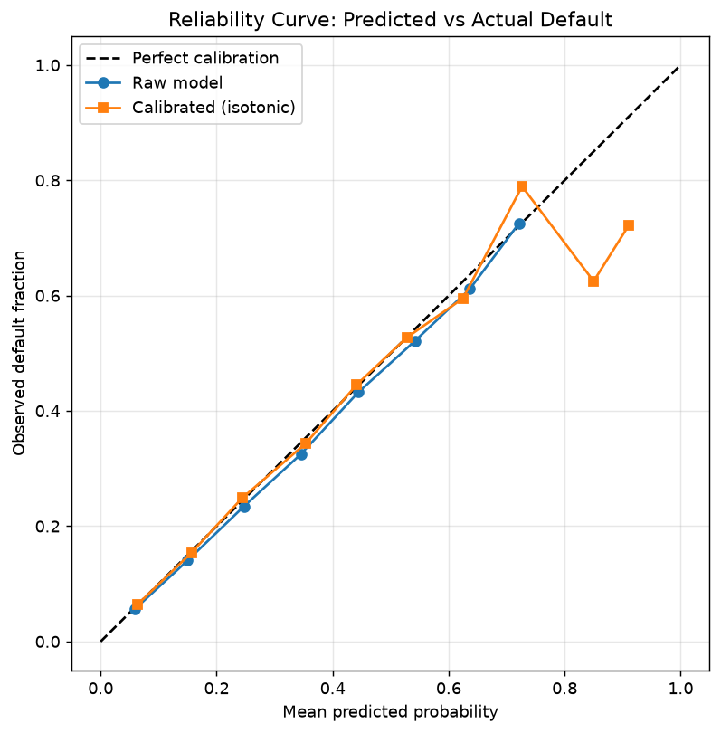

<div align="center">

# Beyond the Score

### A credit decision intelligence platform that optimizes lending policy for profit, not accuracy

**The most accurate model is not the most profitable one. On this book, the gap is worth $80.2M.**

[](https://beyond-the-score-khaki.vercel.app)
[](#calibration-and-data)
[](#technologies-used)
[](https://nextjs.org)
[](#executive-copilot)

<br/>



<br/>

### [▶ Open the live platform](https://beyond-the-score-khaki.vercel.app)

</div>

---

## At a glance

> A 20 second read of the entire project.

- 🎯 **Problem.** Credit models are tuned to predict default accurately. Lenders do not get paid for accuracy. They get paid for the loans they approve, and the two objectives point to different policies.
- 🧠 **Solution.** A four-surface decision intelligence platform built on 225,639 real LendingClub loans: set a policy, stress it against composed economic scenarios, re-optimize under constraints with priced trade-offs, and log every decision with its full context.
- 📈 **Key insight.** The profit-optimal approval cutline (0.29) sits far from the accuracy-optimal one (0.49). Choosing profit over accuracy is worth $80.2M over approving everyone on this out-of-time book, with a bootstrapped 95% confidence interval of $69M to $90M.
- ⚙️ **Stack.** Python for the modeling and decision engines, Next.js, React, and TypeScript for the four-surface front end, a server-side Anthropic API route for the Executive Copilot.
- 🌐 **Live demo.** [beyond-the-score-khaki.vercel.app](https://beyond-the-score-khaki.vercel.app)

---

## Project highlights

✔ Four decision surfaces: Policy Console, Policy Builder, Scenario Studio, Decision Log
✔ Built on 225,639 real LendingClub loans, evaluated strictly out-of-time (2017-2018)
✔ Profit-optimal vs accuracy-optimal cutline divergence quantified: 0.29 vs 0.49
✔ $80.2M lift over approve-all, bootstrapped 95% confidence interval $69M to $90M
✔ Scenario engine that composes recession, funding-cost, and applicant-quality shocks, each band anchored to a cited source ([SOURCES.md](SOURCES.md))
✔ Policy fragility quantified: holding a benign-window policy through severe stress costs $57.7M versus re-optimizing
✔ Constraint-aware optimizer with a shadow-price algorithm that prices every binding constraint
✔ Reject inference over 4.4M declined applications that bounds what the headline can claim
✔ A closed decision loop: compose a world, optimize in it, adopt the policy, and the log remembers
✔ Executive Copilot that narrates only computed facts, through a guarded server-side route

---

## Table of contents

1. [Interactive demo](#interactive-demo)
2. [Key findings](#key-findings)
3. [Overview](#overview)
4. [Why this problem matters](#why-this-problem-matters)
5. [Research question](#research-question)
6. [Modeling methodology](#modeling-methodology)
7. [Platform architecture](#platform-architecture)
8. [Executive Copilot](#executive-copilot)
9. [Calibration and data](#calibration-and-data)
10. [Technologies used](#technologies-used)
11. [Repository structure](#repository-structure)
12. [Installation](#installation)
13. [Running locally](#running-locally)
14. [Future work](#future-work)
15. [Acknowledgements](#acknowledgements)
16. [License](#license)

---

## Interactive demo

**[https://beyond-the-score-khaki.vercel.app](https://beyond-the-score-khaki.vercel.app)**

The live application is the fastest way to understand the result. You are the lender. Try running the loop yourself:

- **On the Console, drag the approval cutline** and watch profit, approval rate, and loss rate move together. The profit-optimal, accuracy-optimal, and committed policies are all marked on the same slider.
- **Read the decision edge.** The Console shows exactly which loans sit at the boundary of your policy, what they look like, and what admitting one more step costs and earns.
- **In Scenario Studio, compose a worse world.** Stack a recession, a funding-cost shock, and applicant-quality drift, and watch the entire book re-price under your outlook.
- **In the Policy Builder, re-optimize under constraints.** Set a loss ceiling or a capital limit, and the optimizer reports not just the best policy but the shadow price of every constraint that binds.
- **Adopt a policy and open the Decision Log.** Every adopted policy is recorded with the outlook and constraints it was decided under, which is the part real lending committees actually need.
- **Ask the Executive Copilot.** It drafts position briefs and board summaries from the numbers the engines computed, and nothing else.

No model runs in your browser. The application serves precomputed results from the offline Python engines, which keeps it fast and keeps every number on screen traceable to a validated computation.

---

## Key findings

All numbers below are computed from the out-of-time book and are reproducible from the committed pipeline.

> **Accuracy and profit disagree about where to draw the line, and the disagreement is expensive.**

**The profit-optimal cutline is not the accuracy-optimal one.** A calibrated default model, asked to maximize classification accuracy, draws the approval line at a predicted default probability of 0.49. Asked to maximize portfolio profit, it draws the line at 0.29. On the 225,639-loan out-of-time book, the profit-optimal policy earns $110.5M against $30.3M for approving everyone, a lift of $80.2M with a bootstrapped 95% confidence interval of $69M to $90M.



**A policy that is optimal in a benign window is fragile out of it.** Scenario Studio composes shocks onto the book and re-prices every loan under the stressed outlook. Under a severe combined stress (recession, funding-cost shock, and applicant-quality drift together), holding the baseline 0.29 cutline yields -$52.4M, while re-optimizing the cutline for the stressed world yields $5.4M. Not adapting the policy costs $57.7M. The finding is not that stress hurts. It is that the correct policy moves, and freezing it is a decision with a price.

**Constraints have prices, and the optimizer reports them.** The Policy Builder walks from the constrained optimum toward the unconstrained one and prices what each binding constraint costs. On the baseline book, a binding loss-rate ceiling is worth about $1.5M per 0.2 percentage points of headroom, and a binding capital constraint is worth about $0.038 of profit per dollar of additional capital.

**Reject inference bounds the headline honestly.** The model is trained on loans that were approved, a favorably selected population. A thin default model built on the features shared between accepted and declined applications scores 4.4M declined applicants at a mean predicted default probability of 0.287, against 0.213 for the accepted-like population, 7.4 percentage points riskier. The headline lift is therefore stated as conditional on the approved population, which is exactly the population a cutline policy operates on.

> The platform's central claim is not a single number. It is that lending policy is a living decision: it should be optimized for profit, stress-tested against composed scenarios, re-optimized when the world moves, and logged with the context it was made in.

---

## Overview

Beyond the Score began as a single question about a single chart: if a credit model's accuracy-optimal threshold and profit-optimal threshold are different points, how much does the difference cost? On real LendingClub data, the answer was $80.2M, and that finding is the platform's front door.

The full platform is what a lender would need to act on that finding. The **Policy Console** is where a policy lives: a committed cutline, the money it earns, the approval rate it implies, and the loans sitting at its decision edge. The **Scenario Studio** is where a policy is doubted: composed economic shocks re-price the whole book and reveal whether the committed line survives the world changing. The **Policy Builder** is where a policy is rebuilt: a constrained optimizer that maximizes profit under loss and capital limits and reports the shadow price of each constraint that binds. The **Decision Log** is where policies are remembered, each with the outlook and constraints it was adopted under. An **Executive Copilot** sits across all four surfaces and narrates the computed facts on demand.

> ### Featured finding
>
> **The profit-optimal approval cutline (0.29) diverges sharply from the accuracy-optimal one (0.49), producing an $80.2M lift over approving everyone, and under severe stress the optimal cutline moves again, making a frozen policy a $57.7M mistake.**
>
> This is the central message of the repository. Everything else exists to establish it rigorously and let you verify it yourself.

---

## Why this problem matters

Nearly every credit model in production is evaluated on discrimination metrics: accuracy, AUC, KS. Those metrics answer the question "how well does the model rank risk," and they are the right way to build the model. They are the wrong way to use it, because a lender's objective is not classification. A false negative (approving a defaulter) and a false positive (declining a good borrower) have completely different dollar values, and those values change with the interest rate, the funding cost, and the loss given default.

When the asymmetric economics are priced in, the best place to draw the approval line moves, usually far from where the accuracy-driven line sits. This project quantifies that gap on real loans and then takes the next step that most threshold analyses skip: the profit-optimal line is only optimal in the world it was computed in. Recessions raise defaults, rate cycles raise funding costs, and applicant pools drift. A decision platform, rather than a static analysis, is what turns a one-time finding into an operable policy.

---

## Research question

> **Given a real loan book, where should a lender set its approval cutline, how much does the accuracy-driven answer cost, and how do the answer and its cost move when the economy or the lender's constraints change?**

The platform holds the modeled book fixed and varies the decision levers a real lending committee would move:

| Lever | What it represents |
| --- | --- |
| Approval cutline | Approve a loan if its predicted default probability is at or below the line |
| Recession shock | A multiplier on predicted default probabilities, band ×1.15 to ×1.7 |
| Funding-cost shock | Additional cost of capital charged against interest income, band +1pp to +4pp |
| Applicant-quality drift | A worsening incoming pool, expressed as a logit shift of +0.10 to +0.35 |
| Loss-rate ceiling | A hard limit on portfolio loss rate |
| Capital constraint | A hard limit on capital deployed |

Every shock band is an assumption carried with a cited source, documented in [SOURCES.md](SOURCES.md).

---

## Modeling methodology

The offline pipeline runs in ordered stages, and every number the application displays traces back to it.

**Default model.** A probability-of-default model is trained on accepted LendingClub loans with known outcomes, then calibrated so that its predicted probabilities are honest: when the model says 30 percent, roughly 30 percent of those loans default.



**Profit layer.** Each loan's predicted default probability is converted into an expected profit using the loan's own economics: interest earned if it performs, principal lost if it defaults, funding cost charged either way. Portfolio profit at a cutline is the sum over every loan the cutline approves.

**Out-of-time evaluation.** The evaluation book is 225,639 loans from 2017-2018, strictly later than the training window. This is the split that matches how a deployed policy actually meets the future.

**Uncertainty.** The headline lift carries a bootstrapped 95 percent confidence interval ($69M to $90M) rather than a point estimate alone.

**Scenario engine.** Shocks re-price the book in expected-value terms: a recession multiplies predicted default probabilities, a funding shock raises the cost leg, quality drift shifts the score distribution in logit space. Composed shocks produce a full profit frontier for the stressed world, and the frontier is what the Policy Builder optimizes on.

**Constrained optimization with shadow prices.** The Policy Builder finds the profit-maximizing cutline subject to loss and capital constraints, then walks from the constrained optimum toward the unconstrained one to measure what each binding constraint costs, a grid-robust equivalent of reading off dual values.

**Reject inference.** A thin model on the features shared between accepted and declined applications scores the declined population, quantifying the selection in the training data and bounding the claims the headline is allowed to make.

---

## Platform architecture

The project is built in two clean layers: an offline modeling and decision pipeline in Python, and an interactive four-surface application in TypeScript. They communicate through aggregated data artifacts only.

```
  Modeling                    Decision engines               Application data
  ────────                    ────────────────               ────────────────
  LendingClub loans    ──►    profit layer,           ──►    aggregate JSONs in
  PD model + calibration      threshold sweeps,              web/src/data/
  out-of-time split           scenario grid,                 (no raw loan data)
                              shadow-price walk                      │
                                                                     ▼
                                            ┌─────────────────────────────────┐
                                            │  Next.js + React + TypeScript   │
                                            │                                 │
   Scenario Studio ── composes an outlook ──►  shared store (outlook,        │
        │                                   │   frontier, adopted policies)   │
        ▼                                   │        │                        │
   Policy Builder ── optimizes on the      │        ▼                        │
   composed frontier, prices constraints    │   Decision Log (persisted)      │
        │                                   │        │                        │
        └── "Adopt this policy" ────────────►        ▼                        │
                                            │   Executive Copilot             │
                                            │   (server-side API route,       │
                                            │    narrates computed facts)     │
                                            └─────────────────────────────────┘
```

The boundary is deliberate. The Python pipeline is the source of truth and is fully reproducible offline. The application never trains a model or invents a number; it reads precomputed results, which keeps the interface instant and makes it impossible for the screen to drift from the validated analysis.

The four surfaces close a loop. Scenario Studio composes a world and hands the exact composed frontier to the shared store. The Policy Builder optimizes on whatever world the store holds. Adopting a policy writes it to the Decision Log with its full context. The next debate starts from the log instead of from memory.

### Design decisions

- **Why profit as the objective.** Accuracy weighs every error the same. A lender's errors are priced in dollars, asymmetrically, per loan. Optimizing the actual objective is the entire finding.
- **Why strict out-of-time validation.** A cutline chosen on data the model has seen flatters itself. The 2017-2018 book is the honest test: it is the future, relative to training.
- **Why precomputed engines rather than in-browser modeling.** The scientific value lives in the validated pipeline, not in any single interactive run. Computing offline makes results reproducible and enforces honesty: the application can never quietly show a number the pipeline did not produce.
- **Why sourced shock bands.** A stress test is only as credible as its assumptions. Every band is carried with a citation ([SOURCES.md](SOURCES.md)) instead of being a slider with an invented range.
- **Why a server-side route for the Copilot.** The API key never ships to the browser, and the route enforces a number guard: the model narrates from the computed facts it is handed, and responses are checked against the allowed numbers.

---

## Executive Copilot

Each surface includes a Copilot drawer that turns the current computed state into an executive narrative: a position brief, an explanation of a change, or a board-ready summary. Two properties matter more than the feature itself:

- **It narrates only computed facts.** The drawer passes the engine's current numbers to a server-side route, and the route instructs the model to use those facts alone. A guard checks the response against the set of allowed numbers.
- **It is a consumer of the platform, not a source of truth.** If the Copilot is removed, every number and finding on every surface is unchanged.

---

## Calibration and data

The dataset is LendingClub's public loan-level data: real consumer loans with real outcomes. The training window precedes the evaluation window, and the evaluation book is 225,639 loans from 2017-2018 held strictly out-of-time.

> **On interpretation.** All profit figures are expected-value computations on a historical book under stated economics, not audited financials. The strength of the platform is in relative and structural conclusions: where the optimal line sits versus the accuracy-driven one, how the line moves under stress, and what the constraints cost. Those conclusions are robust to the exact economic parameters.

> **On data access.** Raw loan-level data is not redistributed in this repository. Only aggregated model outputs, the JSON artifacts the application reads, are committed. Reproducing the pipeline from scratch requires obtaining the LendingClub public dataset independently.

---

## Technologies used

| Layer | Technology | Role |
| --- | --- | --- |
| Modeling | **Python** | Default model, calibration, profit layer, decision engines |
| Modeling | **pandas, NumPy** | Data pipeline and aggregation |
| Modeling | **Bootstrap resampling** | Confidence intervals on the headline lift |
| Frontend | **Next.js (App Router)** | Four-surface application and routing |
| Frontend | **React + TypeScript** | Typed, interactive presentation layer with a shared store |
| Copilot | **Anthropic API** | Server-side narrative generation from computed facts |
| Hosting | **Vercel** | Continuous deployment |

---

## Repository structure

```
beyond-the-score/
├── src/                          # Python modeling and decision pipeline
│   ├── build_model_table.py      # assembles the modeling table from raw loans
│   ├── train_model.py            # trains the probability-of-default model
│   ├── calibrate.py              # calibrates predicted probabilities
│   ├── profit_layer.py           # loan-level economics and portfolio profit
│   ├── bootstrap.py              # bootstrapped confidence intervals
│   ├── segment_analysis.py       # profit by predicted risk segment
│   ├── plot_profit_curve.py      # renders the README profit figure
│   ├── plot_segment.py           # renders the README segment figure
│   ├── export_app_data.py        # writes the aggregate JSONs the app reads
│   └── export_segment_by_threshold.py
├── web/                          # Next.js + TypeScript application (Vercel)
│   └── src/
│       ├── app/                  # Console (/), builder, scenarios, log
│       │   ├── api/copilot/      # server-side Anthropic route with number guard
│       │   └── components/       # CopilotDrawer, Nav
│       ├── lib/store.tsx         # shared outlook, frontier, adopted policies
│       └── data/                 # aggregate JSONs (no raw loan data)
├── SOURCES.md                    # cited sources for every scenario shock band
├── profit_curve.png              # profit vs accuracy cutline divergence
├── segment_profit.png            # where the policy makes and loses money
├── reliability_curve.png         # calibration of the default model
└── README.md
```

---

## Installation

Clone the repository:

```bash
git clone https://github.com/sivakumar-reddy/beyond-the-score.git
cd beyond-the-score
```

**Modeling pipeline (Python)**

```bash
python -m venv .venv
# Windows:        .venv\Scripts\activate
# macOS or Linux: source .venv/bin/activate

pip install pandas numpy scikit-learn matplotlib
```

**Web application**

```bash
cd web
npm install
```

**Executive Copilot (optional).** The Copilot requires an Anthropic API key. Create `web/.env.local` containing `ANTHROPIC_API_KEY=your-key`. Every other surface works without it.

---

## Running locally

**Regenerate the pipeline outputs** (optional; the committed JSONs already contain validated results, and rerunning from scratch requires the raw LendingClub dataset):

```bash
python src/export_app_data.py
```

**Run the interactive application:**

```bash
cd web
npm run dev
```

Then open `http://localhost:3000`. The application reads the aggregate JSONs in `web/src/data/` at build time, so no backend or database is required beyond the optional Copilot route.

---

## Future work

- Named, fully sourced macro scenario presets (for example, a 2008 replay) alongside the composable shocks.
- Per-grade or per-segment cutlines, so the policy is a curve rather than a single line.
- Richer loan economics: prepayment, recoveries over time, and discounting.
- Portfolio-level constraints such as concentration limits by grade or purpose.
- A multi-user Decision Log with authentication, so a committee shares one history.
- Formal reject-inference augmentation of the training population, beyond the current bounding analysis.

---

## Acknowledgements

- **LendingClub**, for the public loan-level dataset that makes an analysis on real outcomes possible.
- **Next.js**, **React**, and **Vercel**, for the application framework and hosting.
- **Anthropic**, for the API behind the Executive Copilot.

---

## License

The source code in this repository is released under the MIT License.

Raw LendingClub loan-level data is not included in this repository and is governed by LendingClub's own terms for its public data releases. Only aggregated model outputs are committed.

---

<div align="center">

### [▶ Open the live platform](https://beyond-the-score-khaki.vercel.app)

Built by [Sivakumar Reddy Yenna](https://www.linkedin.com/in/sivakumar-reddy-yenna)

</div>
